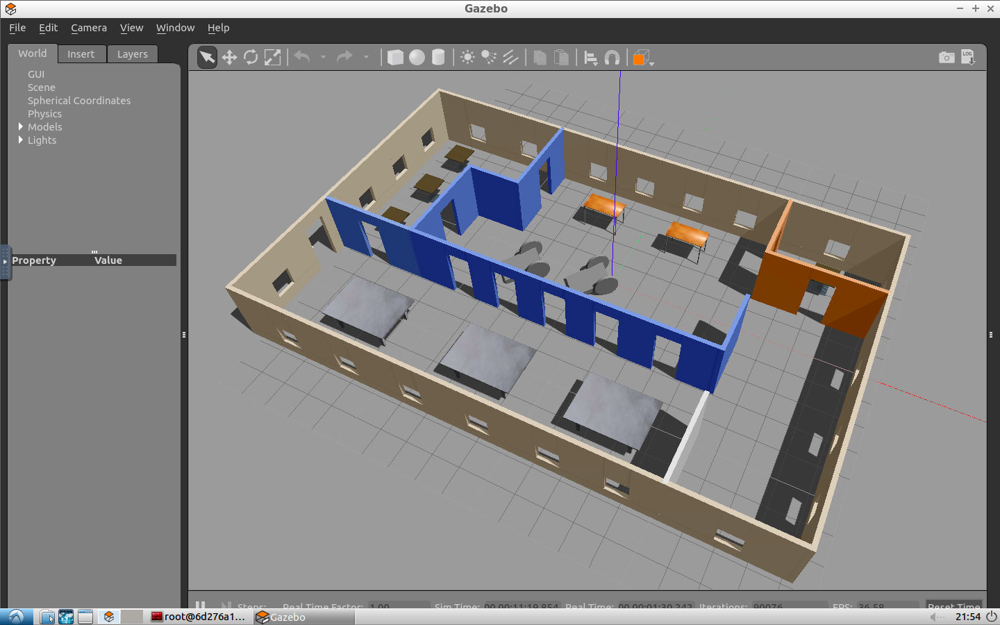

# Build My World - Gazebo Project

# Purpose

Build My World is a gazebo world project included in Udacity's Robotics Nanodegree. I designed a Gazebo world to house a robot inside of an open office environment. This gazebo world was also used as a foundation for other projects within the Nanodegree. 

# Screenshot - Build My World

